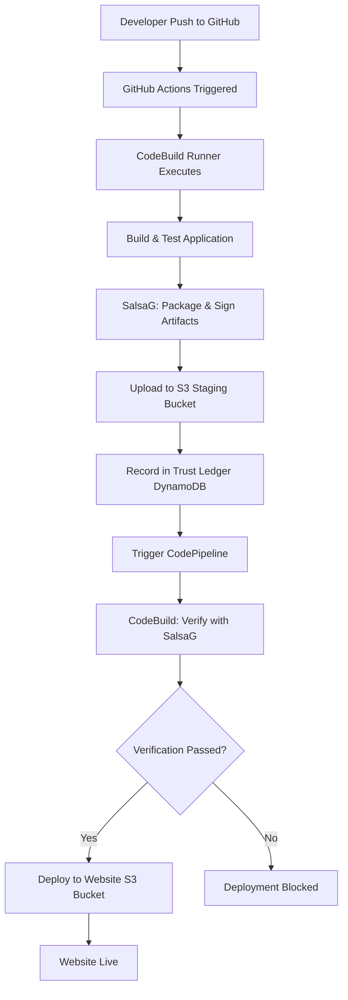
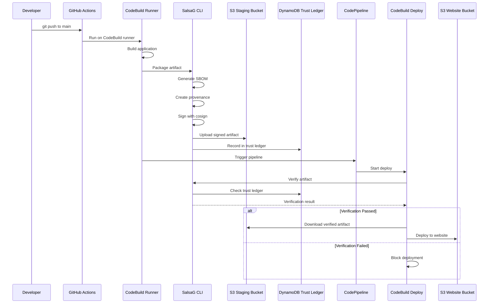
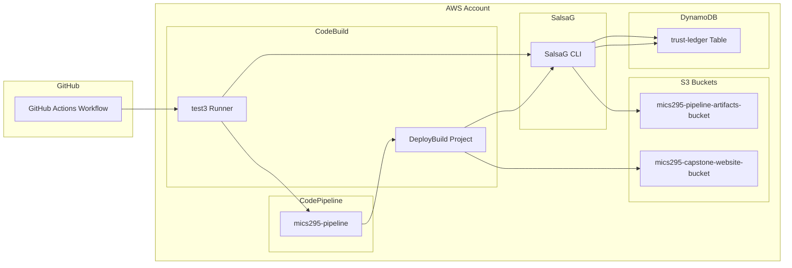

# MICS295 Capstone - Secure CI/CD Pipeline with SalsaG Trust Verification

## Overview
Automated CI/CD pipeline with cryptographic supply chain security for deploying a static website to AWS S3. The pipeline uses **SalsaG CLI** for artifact signing, verification, and trust ledger management, ensuring only verified artifacts are deployed to production.

## Architecture

### High-Level Flow with Trust Pipeline


### Detailed Trust Pipeline Flow


## Infrastructure Components

### AWS Resources


## SalsaG Trust Pipeline

### What is SalsaG?
SalsaG is a supply chain security CLI tool that provides:
- **Artifact Signing**: Cryptographic signing with cosign
- **SBOM Generation**: Software Bill of Materials
- **Provenance Creation**: Build metadata and attestations
- **Trust Ledger**: Centralized verification registry in DynamoDB
- **Fast Verification**: <2 second lookups vs 40+ seconds for crypto verification

### Trust Ledger Architecture
- **Single Source of Truth**: DynamoDB is the authoritative verification registry
- **Fail-Safe Design**: Artifacts not in ledger are immediately rejected
- **Immutable Audit Trail**: Complete history of all verification attempts
- **Performance**: 75% faster than cryptographic verification (10s vs 40s)

## Deployment Flow

### 1. Continuous Integration (GitHub Actions)
**Workflow**: `.github/workflows/deploy-salsag-cli.yml`

**Trigger**: Push to `main` branch (HTML, CSS, JS, or salsag.yml changes)

**Runner**: CodeBuild (`codebuild-test3`)

**Steps**:
1. Checkout code
2. Install SalsaG CLI
3. Install cosign
4. Run tests
5. Build application (create `dist/` folder)
6. **SalsaG Trust Pipeline**:
   - Package artifact as `index.tgz`
   - Generate SBOM (Software Bill of Materials)
   - Create SLSA provenance
   - Sign with cosign (keyless signing)
   - Upload to S3 staging bucket
   - Record in DynamoDB trust ledger
7. Upload legacy `website.zip` for backward compatibility
8. Trigger CodePipeline

### 2. Continuous Deployment (CodePipeline)
**Pipeline**: `mics295-pipeline`

**Stages**:
1. **Source**: S3 bucket (`mics295-pipeline-artifacts-bucket/website.zip`)
2. **ManualApproval**: Manual gate (optional)
3. **Deploy**: CodeBuild project (`DeployBuild`)

**Deploy Steps** (from `buildspec.yml`):
1. Install SalsaG CLI and cosign
2. **Verify with SalsaG**:
   - Query trust ledger for `index.tgz`
   - Validate verification status
   - If failed: Block deployment and exit
3. Download verified artifact from S3
4. Extract content
5. Deploy to website bucket (`mics295-capstone-website-bucket`)

## File Structure
```
├── .github/workflows/
│   ├── deploy-salsag-cli.yml    # Main CI/CD with SalsaG
│   ├── verify-salsag-verifier.yml # Verification demo
│   └── verify-promote.yml        # Manual verification
├── salsag-cli/                   # SalsaG CLI source code
│   ├── salsag/
│   │   ├── __init__.py
│   │   ├── cli.py               # CLI commands
│   │   ├── pipeline.py          # Trust pipeline logic
│   │   └── verifier.py          # Verification logic
│   ├── setup.py
│   └── requirements.txt
├── index.html                    # Main website file
├── salsag.yml                    # SalsaG configuration
├── buildspec.yml                 # CodeBuild deployment spec
├── pipeline.yml                  # CodePipeline template
└── README.md                     # This file
```

## Configuration Files

### SalsaG Configuration (`salsag.yml`)
```yaml
aws:
  region: us-east-1
  staging_bucket: mics295-pipeline-artifacts-bucket
  ledger_table: trust-ledger

skip_signing: true  # Uses CodeBuild IAM role

artifacts:
  compression: "gzip"
  include_sbom: true
  include_provenance: true
```

### GitHub Actions Workflow (`.github/workflows/deploy-salsag-cli.yml`)
- Runs on CodeBuild runner
- Installs SalsaG CLI from local `salsag-cli/` directory
- Executes trust pipeline: `salsaG start --artifact ./dist --config ./salsag.yml`
- Uploads artifacts and triggers CodePipeline

### BuildSpec (`buildspec.yml`)
- Installs SalsaG CLI and cosign
- Verifies artifact: `salsaG verify --artifact index.tgz --config salsag.yml`
- Blocks deployment if verification fails
- Deploys only verified content to website bucket

## AWS Resources

### S3 Buckets

#### Staging Bucket (`mics295-pipeline-artifacts-bucket`)
- **Purpose**: Store signed artifacts and pipeline files
- **Content**: 
  - `index.tgz` - Signed application artifact
  - `sbom-*.spdx.json` - Software Bill of Materials
  - `provenance.json` - SLSA provenance
  - `cosign/` - Signature files (.sig, .pem, .attestation.sigstore)
  - `website.zip` - Legacy format for CodePipeline
- **Access**: CodeBuild runners, CodePipeline

#### Website Bucket (`mics295-capstone-website-bucket`)
- **Purpose**: Host static website
- **Content**: Verified and deployed HTML, CSS, JS files
- **Access**: Public web access
- **URL**: http://mics295-capstone-website-bucket.s3-website-us-east-1.amazonaws.com

### DynamoDB Table

#### Trust Ledger (`trust-ledger`)
- **Purpose**: Central registry of verified artifacts
- **Schema**:
  - `artifact_key` (String, Primary Key): S3 key of artifact
  - `verification_status` (String): "verified" or "failed"
  - `sha256_digest` (String): Artifact hash
  - `timestamp` (String): Verification timestamp
  - `metadata` (Map): Additional verification details
- **Performance**: <2 second lookups
- **Audit Trail**: Immutable record of all verifications

### CodeBuild Projects

#### Runner (`codebuild-test3`)
- **Purpose**: GitHub Actions self-hosted runner
- **Environment**: Amazon Linux, Python 3.11
- **Permissions**: S3, DynamoDB, CodePipeline access

#### Deploy (`DeployBuild`)
- **Purpose**: Verify and deploy artifacts
- **BuildSpec**: `buildspec.yml`
- **Environment**: Amazon Linux, Python 3.9
- **Permissions**: S3, DynamoDB read access

## SalsaG CLI Commands

### Start Trust Pipeline
```bash
salsaG start --artifact ./dist --config ./salsag.yml
```
Packages, signs, uploads, and records artifact in trust ledger.

### Verify Artifact
```bash
salsaG verify --artifact index.tgz --config ./salsag.yml
```
Checks trust ledger for verification status.

### Check Status
```bash
salsaG status --artifact index.tgz --config ./salsag.yml
```
Displays detailed verification information.

### Initialize Configuration
```bash
salsaG init
```
Creates default `salsag.yml` configuration file.

## Deployment Process

### Automated Deployment
```bash
# Make changes to code
echo "<p>New content</p>" >> index.html

# Commit and push
git add index.html
git commit -m "Update website"
git push origin main

# GitHub Actions automatically:
# 1. Builds and signs with SalsaG
# 2. Records in trust ledger
# 3. Triggers CodePipeline
# 4. CodePipeline verifies and deploys
```

### Manual Pipeline Trigger
```bash
# Trigger pipeline manually
aws codepipeline start-pipeline-execution --name mics295-pipeline --region us-east-1
```

### Check Trust Ledger
```bash
# View all verified artifacts
aws dynamodb scan --table-name trust-ledger --region us-east-1

# Check specific artifact
aws dynamodb get-item \
  --table-name trust-ledger \
  --key '{"artifact_key":{"S":"index.tgz"}}' \
  --region us-east-1
```

## Security Features

### Supply Chain Security
- **Cryptographic Signing**: All artifacts signed with cosign
- **SBOM**: Complete dependency inventory
- **SLSA Provenance**: Build integrity attestation
- **Keyless Signing**: GitHub OIDC eliminates long-lived credentials
- **Tamper Detection**: Modified artifacts fail verification
- **Zero-Trust Deployment**: Only verified artifacts reach production

### Trust Ledger Benefits
- **Single Source of Truth**: DynamoDB is authoritative
- **Fail-Safe**: Unknown artifacts are rejected
- **Immutable Audit**: Complete verification history
- **Fast Verification**: 75% faster than crypto verification
- **Compliance Ready**: Complete audit trail for regulations

### IAM Permissions
- **CodeBuild Runner**: S3 write, DynamoDB write, CodePipeline trigger
- **Deploy Build**: S3 read, DynamoDB read
- **Least Privilege**: Minimal permissions for each component

## Monitoring & Logs

### GitHub Actions Logs
- Available in GitHub repository Actions tab
- Shows CI pipeline and SalsaG execution
- Real-time progress indicators

### CodeBuild Logs
- CloudWatch Logs: `/aws/codebuild/DeployBuild`
- SalsaG verification output
- Deployment status

### Trust Ledger Audit
```bash
# Query verification history
aws dynamodb scan --table-name trust-ledger \
  --region us-east-1 \
  --query 'Items[*].[artifact_key.S,verification_status.S,timestamp.S]' \
  --output table
```

### Pipeline Status
- **GitHub Actions**: Repository Actions tab
- **CodePipeline**: AWS Console → CodePipeline → mics295-pipeline
- **Website**: Visit S3 website URL

## Troubleshooting

### Common Issues

#### 1. Verification Failed
```
❌ Artifact VERIFICATION FAILED
  ❌ Trust ledger verification failed
```
**Solution**: Artifact not in trust ledger. Trigger GitHub Actions to build and sign new artifact.

#### 2. Access Denied to S3
```
An error occurred (AccessDenied) when calling the PutObject operation
```
**Solution**: Check bucket names in `salsag.yml` and `buildspec.yml` match actual bucket names.

#### 3. SalsaG CLI Not Found
```
salsaG: command not found
```
**Solution**: Ensure SalsaG CLI is installed: `cd salsag-cli && pip install -e .`

#### 4. Empty Trust Ledger
**Solution**: Run GitHub Actions workflow to create signed artifacts and populate ledger.

### Debug Commands
```bash
# Check staging bucket
aws s3 ls s3://mics295-pipeline-artifacts-bucket/ --recursive

# Check website bucket
aws s3 ls s3://mics295-capstone-website-bucket/

# Check trust ledger
aws dynamodb scan --table-name trust-ledger --region us-east-1

# View recent builds
aws codebuild list-builds-for-project --project-name DeployBuild --region us-east-1

# Get build logs
aws logs tail /aws/codebuild/DeployBuild --follow
```

## Performance Metrics

### Trust Ledger vs Cryptographic Verification
- **Trust Ledger Lookup**: ~2 seconds
- **Cryptographic Verification**: ~40 seconds
- **Performance Improvement**: 75% faster

### Pipeline Execution Times
- **GitHub Actions (CI)**: 19-56 seconds
- **CodePipeline (CD)**: 4-5 minutes (including manual approval)
- **Total End-to-End**: ~6 minutes

## Benefits

### Supply Chain Security
- Cryptographic proof of artifact integrity
- Complete audit trail for compliance
- Tamper detection and prevention
- Zero-trust deployment model

### Performance
- 75% faster verification with trust ledger
- Single source of truth eliminates complexity
- Fast artifact lookups (<2 seconds)

### Operational Excellence
- Automated signing and verification
- Fail-safe deployment blocking
- Comprehensive logging and monitoring
- Backward compatible with existing pipeline

### Scalability
- Independent CI/CD components
- Reusable trust pipeline
- Multi-environment support ready
- Easy integration with additional services

## Future Enhancements
- Multi-environment support (dev, staging, prod)
- Slack/email notifications for verification failures
- Dashboard for trust ledger visualization
- Integration with additional security scanning tools
- Remote SalsaG SaaS implementation with API Gateway

---

**Project**: UC Berkeley MICS Capstone (Cyber295)  
**Last Updated**: November 2025
