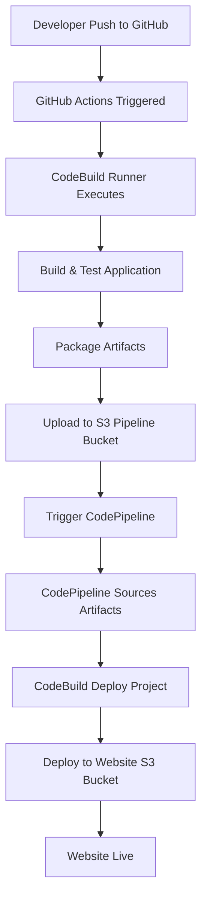
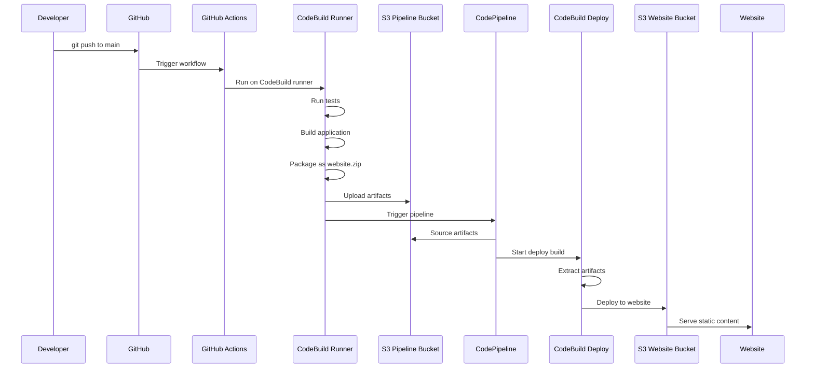
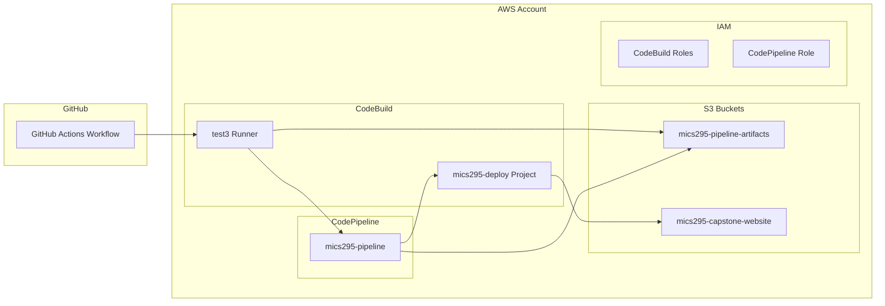

# MICS295 Capstone - CI/CD Pipeline for Static Website

## Overview
Automated CI/CD pipeline for deploying a static HTML website to AWS S3 using GitHub Actions and AWS CodePipeline.

## Architecture

### High-Level Flow


### Detailed CI/CD Pipeline


## Infrastructure Components

### AWS Resources


## Deployment Flow

### 1. Continuous Integration (GitHub Actions)
- **Trigger**: Push to `main` branch
- **Runner**: CodeBuild (`test3`)
- **Steps**:
  1. Checkout code
  2. Run tests
  3. Build application
  4. Package artifacts (`website.zip`)
  5. Upload to `mics295-pipeline-artifacts` bucket
  6. Trigger CodePipeline

### 2. Continuous Deployment (CodePipeline)
- **Source**: S3 bucket (`mics295-pipeline-artifacts/website.zip`)
- **Deploy**: CodeBuild project (`mics295-deploy`)
- **Steps**:
  1. Download artifacts from S3
  2. Extract `website.zip`
  3. Sync content to `mics295-capstone-website` bucket
  4. Website becomes live

## File Structure
```
├── .github/workflows/
│   └── deploy.yml          # GitHub Actions workflow
├── index.html              # Main website file
├── buildspec.yml           # CodeBuild deployment spec
├── pipeline.yml            # CodePipeline CloudFormation template
├── codebuild-setup.yml     # CodeBuild runner setup
└── README.md               # This file
```

## Configuration Files

### GitHub Actions Workflow (`.github/workflows/deploy.yml`)
- Runs on CodeBuild runner
- Packages application
- Uploads artifacts to S3
- Triggers CodePipeline

### BuildSpec (`buildspec.yml`)
- Defines CodeBuild deployment steps
- Extracts artifacts
- Deploys to S3 website bucket

### Pipeline Template (`pipeline.yml`)
- CloudFormation template for CodePipeline
- Creates IAM roles and CodeBuild projects
- Configures pipeline stages

## Buckets

### Pipeline Artifacts (`mics295-pipeline-artifacts`)
- **Purpose**: Store build artifacts and pipeline files
- **Content**: `website.zip` from GitHub Actions
- **Access**: CodePipeline source

### Website (`mics295-capstone-website`)
- **Purpose**: Host static website
- **Content**: Deployed HTML, CSS, JS files
- **Access**: Public web access
- **URL**: http://mics295-capstone-website.s3-website-us-east-1.amazonaws.com

## Deployment Process

### Manual Trigger
```bash
# Make changes to code
echo "<p>New content</p>" >> index.html

# Commit and push
git add .
git commit -m "Update website"
git push origin main

# Pipeline automatically triggers
```

### Pipeline Status
- **GitHub Actions**: Check Actions tab in repository
- **CodePipeline**: AWS Console → CodePipeline → mics295-pipeline
- **Website**: Visit the S3 website URL

## Security & Permissions

### CodeBuild Runner Permissions
- S3 access to both buckets
- CodePipeline execution permissions
- CloudWatch Logs access
- Secrets Manager access (for GitHub integration)

### CodePipeline Permissions
- S3 bucket access
- CodeBuild project execution
- IAM role assumptions

## Monitoring & Logs

### GitHub Actions Logs
- Available in GitHub repository Actions tab
- Shows CI pipeline execution

### CodeBuild Logs
- CloudWatch Logs: `/aws/codebuild/test3` and `/aws/codebuild/mics295-deploy`
- Build execution details and deployment status

### CodePipeline Monitoring
- AWS Console pipeline view
- Stage-by-stage execution status
- Integration with CloudWatch

## Troubleshooting

### Common Issues
1. **GitHub Actions queued**: Check CodeBuild runner configuration
2. **Pipeline fails**: Verify S3 artifact exists and buildspec.yml syntax
3. **Website not updating**: Check S3 sync in CodeBuild deploy logs
4. **Permission errors**: Verify IAM roles and policies

### Debug Commands
```bash
# Check pipeline artifacts
aws s3 ls s3://mics295-pipeline-artifacts/

# Check website content
aws s3 ls s3://mics295-capstone-website/

# View recent builds
aws codebuild list-builds-for-project --project-name mics295-deploy
```

## Benefits

### Separation of Concerns
- **GitHub Actions**: CI (testing, building, packaging)
- **CodePipeline**: CD (deployment orchestration)
- **CodeBuild**: Execution environment

### Scalability
- Independent scaling of CI and CD components
- Reusable pipeline for multiple environments
- Easy integration with additional AWS services

### Security
- Separate buckets for artifacts and website
- IAM roles with least privilege
- Encrypted artifact storage
