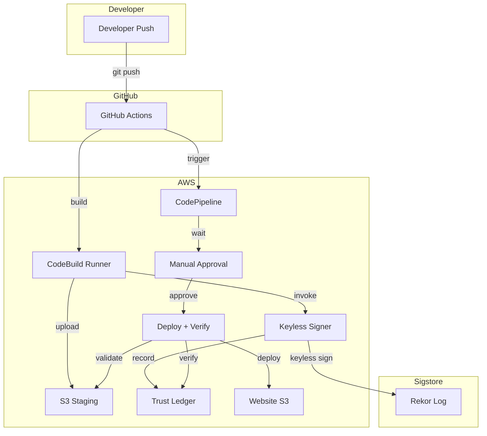

# SalsaGate - Supply Chain Security Pipeline

## Overview

SalsaGate is a cloud-agnostic supply chain security framework that implements SLSA compliance through cryptographic signing, public transparency logging, and tamper-evident verification. The system uses **Sigstore keyless signing** to eliminate key management overhead while maintaining enterprise-grade security.

## Key Features

✅ **Keyless Signing** - Sigstore identity-based signing (no keys to manage)  
✅ **Cloud-Agnostic** - No vendor lock-in, works anywhere with OIDC  
✅ **Public Transparency** - Rekor immutable audit log  
✅ **Tamper Detection** - Checksum validation blocks modified artifacts  
✅ **Zero-Trust Deployment** - Mandatory verification before production  
✅ **SLSA Compliant** - Meets SLSA Level 3 requirements  

## Architecture



## How It Works

### 1. Build & Sign (GitHub Actions)
```bash
# Developer pushes code
git push origin main

# GitHub Actions:
# - Builds application
# - Packages as index.tgz
# - Uploads to S3
# - Invokes keyless signer
```

### 2. Keyless Signing (CodeBuild)
```bash
# Signer service:
COSIGN_EXPERIMENTAL=1 cosign sign-blob \
  --bundle artifact.tgz.bundle \
  --yes \
  artifact.tgz

# - Signs with OIDC identity (no keys!)
# - Uploads to Rekor transparency log
# - Records digest in DynamoDB trust ledger
```

### 3. Verification & Deploy (CodePipeline)
```bash
# Deploy stage:
salsaG verify --artifact index.tgz

# Checks:
# ✅ Trust ledger: artifact exists
# ✅ Checksum: SHA256 matches
# ✅ Rekor: public proof available

# If verified → Deploy to production
# If failed → Block deployment
```

## Quick Start

### Prerequisites
- AWS Account
- GitHub repository
- AWS CLI configured

### Setup

1. **Create S3 Buckets**
```bash
aws s3 mb s3://mics295-pipeline-artifacts-bucket
aws s3 mb s3://mics295-capstone-website-bucket
```

2. **Create DynamoDB Table**
```bash
aws dynamodb create-table \
  --table-name trust-ledger \
  --attribute-definitions AttributeName=object_key,AttributeType=S \
  --key-schema AttributeName=object_key,KeyType=HASH \
  --billing-mode PAY_PER_REQUEST
```

3. **Deploy Services**
```bash
cd trust-service
./deploy-codebuild-signer.sh
./deploy-verifier.sh
```

4. **Configure GitHub Actions**
- Update `.github/workflows/deploy-salsag-cli.yml` with your bucket names
- Push to trigger pipeline

### Test

```bash
# Make a change
echo "test" >> index.html
git add index.html
git commit -m "Test deployment"
git push

# Monitor
gh run watch
aws codepipeline get-pipeline-state --name mics295-pipeline
```

## Project Structure

```
├── .github/workflows/
│   └── deploy-salsag-cli.yml    # CI/CD pipeline
├── trust-service/
│   ├── buildspec-signer.yml     # Keyless signing service
│   ├── buildspec-verifier.yml   # Standalone verifier
│   ├── deploy-codebuild-signer.sh
│   └── deploy-verifier.sh
├── salsag-cli/                  # SalsaG CLI tool
│   └── salsag/
│       ├── cli.py
│       ├── core.py
│       └── rekor_client.py
├── tamper/                      # Negative test artifacts
│   ├── index.tgz               # Tampered artifact
│   └── README.md
├── buildspec.yml                # Deploy verification
├── salsag.yml                   # Configuration
├── index.html                   # Application
└── TECHNICAL_DOCUMENTATION.md   # Detailed docs
```

## Configuration

**salsag.yml**:
```yaml
aws:
  region: us-east-1
  staging_bucket: mics295-pipeline-artifacts-bucket
  ledger_table: trust-ledger

skip_signing: true  # Signing done by CodeBuild service

artifacts:
  compression: "gzip"
  include_sbom: true
  include_provenance: true
```

## Security

### Keyless Signing
- **No keys to manage** - Uses OIDC identity from CodeBuild
- **Short-lived certificates** - Issued by Sigstore Fulcio CA
- **Public transparency** - All signatures in Rekor log
- **Identity-based** - Certificate tied to build system

### Tampering Detection
```bash
# Scenario: Attacker modifies artifact after signing

# System response:
# 1. Downloads artifact from S3
# 2. Calculates SHA256: abc123...
# 3. Compares with ledger: def456...
# 4. Mismatch detected → Deployment BLOCKED
```

### Trust Ledger
- **Single source of truth** - DynamoDB authoritative registry
- **Immutable audit trail** - Complete verification history
- **Fast lookups** - <2 second verification
- **Fail-safe** - Unknown artifacts rejected

## Testing

### Positive Test (Clean Deployment)
```bash
# Push code → Sign → Verify → Deploy
# Expected: ✅ Deployment succeeds
```

### Negative Test (Tamper Detection)
```bash
# 1. Trigger pipeline
# 2. Wait for manual approval
# 3. Tamper with artifact:
aws s3 cp tamper/index.tgz s3://mics295-pipeline-artifacts-bucket/index.tgz

# 4. Approve pipeline
# Expected: ❌ Deployment blocked with "Checksum verification failed"
```

## Monitoring

### Check Trust Ledger
```bash
aws dynamodb scan --table-name trust-ledger
```

### Verify in Rekor
```bash
# Get log index from ledger
REKOR_ID=686027146

# Query public log
curl "https://rekor.sigstore.dev/api/v1/log/entries?logIndex=$REKOR_ID"
```

### View Logs
```bash
# Signing logs
aws logs tail /aws/codebuild/salsag-artifact-signer --follow

# Deploy logs
aws logs tail /aws/codebuild/DeployBuild --follow

# Verifier logs
aws logs tail /aws/codebuild/salsag-artifact-verifier --follow
```

## Troubleshooting

**Verification Failed**
```
❌ Checksum verification failed
```
→ Artifact was tampered with (expected for negative tests)

**Signing Failed**
```
Error: COSIGN_EXPERIMENTAL not set
```
→ Ensure `COSIGN_EXPERIMENTAL=1` in buildspec

**Ledger Not Found**
```
Artifact not found in ledger
```
→ Run GitHub Actions to sign and record artifact

## Performance

| Stage | Time | Notes |
|-------|------|-------|
| GitHub Actions | ~1 min | Build + sign |
| Keyless Signing | ~5 sec | No key operations |
| Manual Approval | Variable | Human gate |
| Verification | ~3 sec | Ledger + checksum |
| Deployment | ~10 sec | S3 upload |
| **Total E2E** | **~6 min** | With approval |

## Documentation

- **[TECHNICAL_DOCUMENTATION.md](TECHNICAL_DOCUMENTATION.md)** - Complete technical details
- **[tamper/README.md](tamper/README.md)** - Negative testing guide

## Benefits

### vs Traditional Signing
| Feature | Traditional | SalsaGate |
|---------|------------|-----------|
| Key Management | Manual | None (keyless) |
| Key Rotation | Manual | Automatic |
| Cloud Lock-in | Yes | No (OIDC) |
| Public Audit | No | Yes (Rekor) |
| Setup Time | Hours | Minutes |

### vs No Signing
| Risk | Without Signing | With SalsaGate |
|------|----------------|----------------|
| Tampered artifacts | ❌ Deployed | ✅ Blocked |
| Supply chain attacks | ❌ Undetected | ✅ Detected |
| Compliance | ❌ Failed | ✅ SLSA L3 |
| Audit trail | ❌ None | ✅ Complete |

## Contributing

This is a UC Berkeley MICS Capstone project demonstrating supply chain security best practices.

## License

Educational use - UC Berkeley MICS Program

---

**Project**: UC Berkeley MICS Capstone (Cyber295)  
**Last Updated**: November 2025  
**Status**: Production-ready with keyless signing
