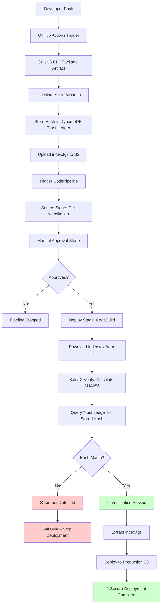

# SalsaG Security Pipeline Flow

## Overview

SalsaG (Software Artifact Ledger Security and Governance) implements a comprehensive security pipeline that provides tamper detection and artifact integrity verification through cryptographic hashing and trust ledger management.

## Architecture Components

- **GitHub Actions**: Build and signing environment
- **SalsaG CLI**: Core security tool for signing and verification
- **DynamoDB Trust Ledger**: Immutable record of artifact hashes
- **S3 Bucket**: Artifact storage
- **CodePipeline + CodeBuild**: Deployment pipeline with verification

## Security Flow

### Phase 1: Build & Sign (GitHub Actions)

1. **Artifact Creation**: Package `./dist` directory into `index.tgz`
2. **Hash Generation**: Calculate SHA256 of `index.tgz`
3. **Trust Ledger Entry**: Store hash in DynamoDB
4. **Artifact Upload**: Upload `index.tgz` to S3
5. **Pipeline Trigger**: Trigger CodePipeline for deployment

### Phase 2: Verification & Deploy (CodePipeline)

1. **Manual Approval**: Security gate for controlled deployment
2. **Artifact Download**: Download `index.tgz` from S3
3. **Hash Verification**: Calculate SHA256 and compare with trust ledger
4. **Tamper Detection**: Fail deployment if hashes don't match
5. **Secure Deployment**: Deploy only verified artifacts

## Mermaid Flow Diagram



## Trust Ledger Schema

### DynamoDB Table: `trust-ledger`

```json
{
  "object_key": "s3://mics295-pipeline-artifacts/index.tgz",
  "digest": "sha256:2de17cd4522bfe628f70484a8372d9dbffb24e4006ba9ff85fed256074ea8d2b",
  "status": "verified",
  "timestamp": "2025-10-14T05:46:06.532236",
  "details": "Signed and verified by SalsaG CLI",
  "artifacts": {
    "tarball": "s3://mics295-pipeline-artifacts/index.tgz",
    "sbom": "s3://mics295-pipeline-artifacts/sbom-20251014-054536.spdx.json",
    "provenance": "s3://mics295-pipeline-artifacts/provenance.json",
    "signature": "s3://mics295-pipeline-artifacts/cosign/index.tgz.sig",
    "certificate": "s3://mics295-pipeline-artifacts/cosign/index.tgz.pem",
    "attestation": "s3://mics295-pipeline-artifacts/cosign/index.tgz.attestation.sigstore"
  }
}
```

## Hash Generation Algorithm

```python
def _calculate_sha256(self, file_path: Path) -> str:
    """Calculate SHA256 hash of file"""
    hash_sha256 = hashlib.sha256()
    with open(file_path, "rb") as f:
        for chunk in iter(lambda: f.read(4096), b""):
            hash_sha256.update(chunk)
    return hash_sha256.hexdigest()
```

## Security Properties

### Tamper Detection
- **Cryptographic Integrity**: SHA256 provides collision resistance
- **Bit-level Sensitivity**: Any modification changes the hash
- **Immutable Record**: Trust ledger preserves original hash

### Attack Scenarios Prevented

1. **Malicious File Replacement**: Attacker replaces `index.tgz` in S3
   - ❌ **Blocked**: Hash mismatch detected during verification
   
2. **Supply Chain Compromise**: Compromised artifact in pipeline
   - ❌ **Blocked**: Only artifacts with valid trust ledger entries deploy
   
3. **Man-in-the-Middle**: Artifact modified during transfer
   - ❌ **Blocked**: End-to-end hash verification catches modifications

## Verification Commands

### Build Time (GitHub Actions)
```bash
salsaG start --artifact ./dist --config ./salsag.yml
```

### Deploy Time (CodeBuild)
```bash
salsaG verify --artifact index.tgz --config salsag.yml
```

## Configuration

### salsag.yml
```yaml
aws:
  region: us-east-1
  staging_bucket: mics295-pipeline-artifacts
  ledger_table: trust-ledger

skip_signing: true

artifacts:
  compression: "gzip"
  include_sbom: true
  include_provenance: true
```

## Testing Scenarios

### Happy Path ✅
1. Legitimate artifact with matching hash
2. Verification passes
3. Deployment succeeds

### Tamper Detection ❌
1. Artifact modified after signing
2. Hash mismatch detected
3. Deployment blocked with error

## Security Benefits

- **Zero Trust**: Every artifact verified before deployment
- **Audit Trail**: Complete history in trust ledger
- **Fail-Safe**: Default to block on verification failure
- **Transparency**: Clear verification status and error messages
- **Compliance**: Cryptographic proof of artifact integrity

## Future Enhancements

- **Cosign Integration**: Full cryptographic signatures
- **Multi-signature**: Require multiple approvers
- **Policy Engine**: Custom verification rules
- **Notification System**: Alert on tamper detection
