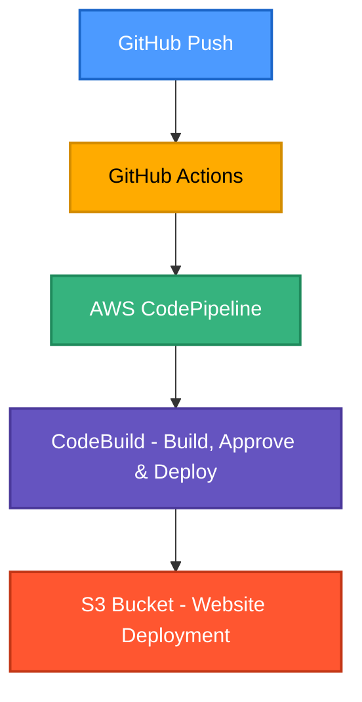

# Deployment Flow Diagram

```mermaid
graph TD
    A[GitHub Push] --> B[GitHub Actions]
    B --> C[AWS CodePipeline]
    C --> D[CodeBuild - Build, Approve & Deploy]
    D --> E[S3 Bucket - Website Deployment]

    %% Styling
    style A fill:#4c9aff,stroke:#1b66c9,stroke-width:2px,color:#fff
    style B fill:#ffab00,stroke:#d48d00,stroke-width:2px,color:#000
    style C fill:#36b37e,stroke:#1f8a5c,stroke-width:2px,color:#fff
    style D fill:#6554c0,stroke:#4a389a,stroke-width:2px,color:#fff
    style E fill:#ff5630,stroke:#c23616,stroke-width:2px,color:#fff
```
