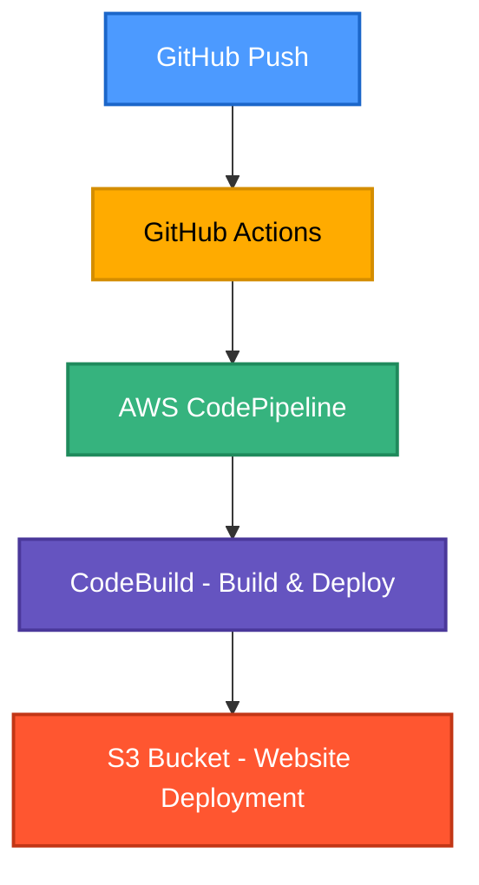
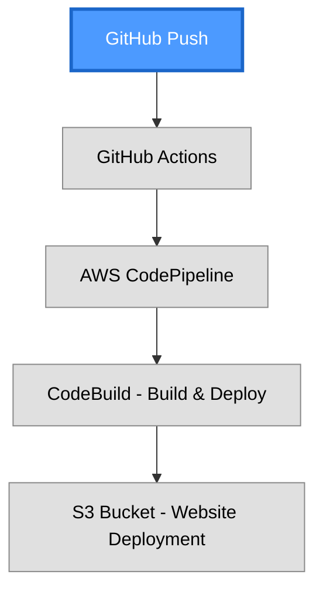
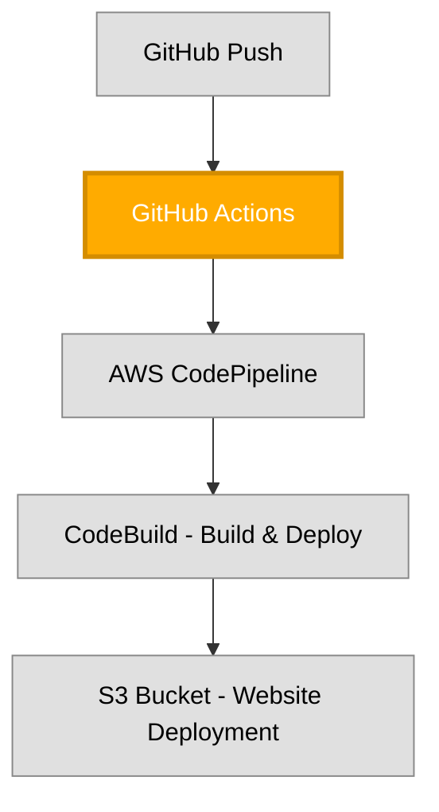
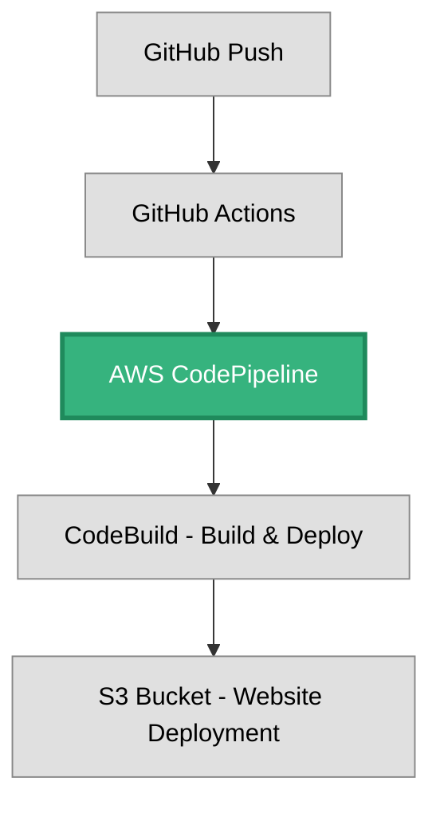
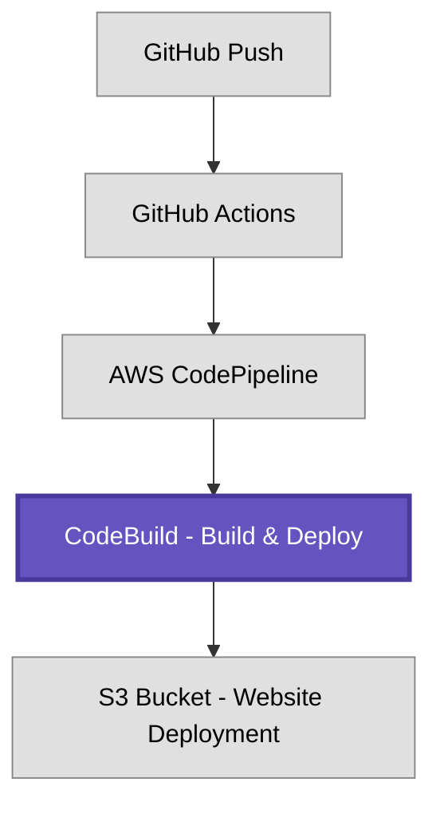
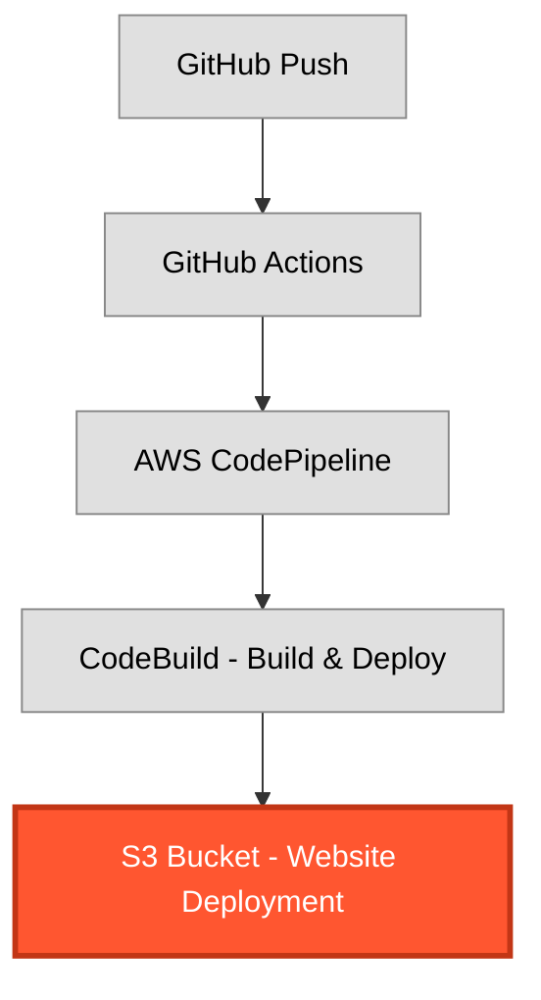

# Deployment Flow Diagram

```mermaid
graph TD
    A[GitHub Push] --> B[GitHub Actions]
    B --> C[AWS CodePipeline]
    C --> D[CodeBuild - Build & Deploy]
    D --> E[S3 Bucket - Website Deployment]

    %% Styling
    style A fill:#4c9aff,stroke:#1b66c9,stroke-width:2px,color:#fff
    style B fill:#ffab00,stroke:#d48d00,stroke-width:2px,color:#000
    style C fill:#36b37e,stroke:#1f8a5c,stroke-width:2px,color:#fff
    style D fill:#6554c0,stroke:#4a389a,stroke-width:2px,color:#fff
    style E fill:#ff5630,stroke:#c23616,stroke-width:2px,color:#fff
```

## Animated‑Style Version

*(Note: Mermaid doesn't support true motion animation, but this version simulates animation using sequential highlighting styles.)*

```mermaid
graph TD
    A[GitHub Push] --> B[GitHub Actions]
    B --> C[AWS CodePipeline]
    C --> D[CodeBuild - Build & Deploy]
    D --> E[S3 Bucket - Website Deployment]

    %% Base styling
    classDef base fill:#e0e0e0,stroke:#888,color:#000,stroke-width:1px;
    classDef active fill:#4c9aff,stroke:#1b66c9,color:#fff,stroke-width:3px;

    %% Simulated animation using a sequence of delays
    %% (Rendered engines will highlight nodes in order)
    class A active;
    class B base;
    class C base;
    class D base;
    class E base;
```

```mermaid
%% Step 2
graph TD
    A[GitHub Push] --> B[GitHub Actions]
    B --> C[AWS CodePipeline]
    C --> D[CodeBuild - Build & Deploy]
    D --> E[S3 Bucket - Website Deployment]

    classDef base fill:#e0e0e0,stroke:#888,color:#000,stroke-width:1px;
    classDef active fill:#ffab00,stroke:#d48d00,color:#fff,stroke-width:3px;

    class A base;
    class B active;
    class C base;
    class D base;
    class E base;
```

```mermaid
%% Step 3
graph TD
    A[GitHub Push] --> B[GitHub Actions]
    B --> C[AWS CodePipeline]
    C --> D[CodeBuild - Build & Deploy]
    D --> E[S3 Bucket - Website Deployment]

    classDef base fill:#e0e0e0,stroke:#888,color:#000,stroke-width:1px;
    classDef active fill:#36b37e,stroke:#1f8a5c,color:#fff,stroke-width:3px;

    class A base;
    class B base;
    class C active;
    class D base;
    class E base;
```

```mermaid
%% Step 4
graph TD
    A[GitHub Push] --> B[GitHub Actions]
    B --> C[AWS CodePipeline]
    C --> D[CodeBuild - Build & Deploy]
    D --> E[S3 Bucket - Website Deployment]

    classDef base fill:#e0e0e0,stroke:#888,color:#000,stroke-width:1px;
    classDef active fill:#6554c0,stroke:#4a389a,color:#fff,stroke-width:3px;

    class A base;
    class B base;
    class C base;
    class D active;
    class E base;
```

```mermaid
%% Step 5
graph TD
    A[GitHub Push] --> B[GitHub Actions]
    B --> C[AWS CodePipeline]
    C --> D[CodeBuild - Build & Deploy]
    D --> E[S3 Bucket - Website Deployment]

    classDef base fill:#e0e0e0,stroke:#888,color:#000,stroke-width:1px;
    classDef active fill:#ff5630,stroke:#c23616,color:#fff,stroke-width:3px;

    class A base;
    class B base;
    class C base;
    class D base;
    class E active;
```
